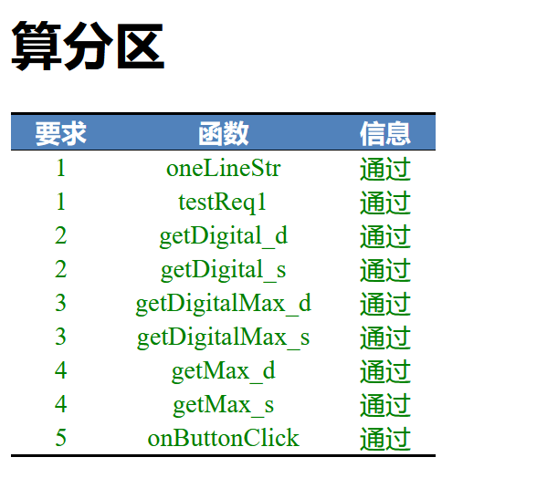
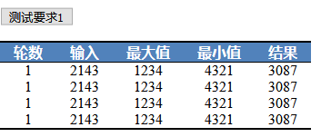

## 注意
### innerHTML写入问题
innerHTML不能分次写入，例如：
```javascript
tag.innerHTML = "<tr>";
tag.innerHTML +="<td>";
tag.innerHTML +="1";
tag.innerHTML +="</td>";
tag.innerHTML +="</tr>";
```
因为浏览器在第一行```tag.innerHTML="<tr>"```时就会帮你把后面的```</tr>```补上，**所以你必须一次性写入一个完整的tag**：
```javascript
s = "<tr>";
s +="<td>";
s +="1";
s +="</td>";
s += "</tr>"
tag.innerHTML = s;
```

### 自动批改机制
本次作业能够自动批改，当你修改完代码，直接刷新页面即可看到自己的成果。

如果都通过，就是这个界面。
分数不必在意，这个内容是用来让你们判断下自己的进度，以及检查错误在哪里的。
有错误，则右侧信息部分会给出错误的信息。
另一个可能性是你代码导致的异常，请你检查console的输出并报告给我。
以下是正文

---

## 黑洞数

### 复读一下要求
取任意一个四位数字n，n的4个数字不能相同。
取其所有数字组合中的最大值减去其所有组合的最小值。得到新数字n，对新数字n重复上述过程。最后会落入6174这个数字，以4138为例：
4138，四个数字组合最大值为8431，最小为1348，差为7083。
7083，四个数字组合最大值为8730，最小值为378（0省略），差为8352。
8352，四个数字组合最大值为8532，最小值为2358，差为6174。
因为6174的四个数字组合最大值为7641，最小值为1466，差为6174，此时就出不去了。

### 解题思路的分解
一定要注意，一个复杂问题，只有合理分解，才能很好解决。
这道题的分解思路也是很明白的：
1. 获取n
2. 写一个循环，此时你可能拿不准循环的结束条件，不要紧。但肯定能想到这里需要有一个循环。
3. 求n各个位数排列的最大值（你可以顺便定下变量名，比如max_n）。
4. 求n各个位数排列的最小值（顺便定下变量名，min_n）
5. 求两个数字之差（result），此时一个步骤已经完成，因此你需要：
6. 产生一行输出。
7. 复读，但要记得将result赋值给n，同时这里可以得到停机条件，当n==6174时，停机。

先用伪代码或者流程图画一下，比如伪代码就是：
```JavaScript
function onButtonClick(){
    getNumber();
    while(true){ // 死循环，条件在下面给出
        max_n = getMax();
        min_n = getMin();
        result = max_n-min_n;
        outputOneLine();
        n == result;
        if(n==6174){
            break;
        }
    }
}
```
注意我这里写了函数，但没有定义参数，设计阶段你并不需要将代码真正写出来，因此可以简略一些没关系。
有些代码，比如```if(n==6174){break;}```这种操作，从美学的角度，很丑，但有助于你理清思路，不必过分在意，等你写完了，你可以想想，是否可以用更优雅的方式（比如放在while里判断）来实现，现在这个阶段，关键是思路。
你们可能注意到这个逻辑拆分成好几个函数来写。
有些同学习惯于一个函数完成所有的功能，这种倾向是不好的，这样会使你的代码变得很长，不管是读代码还是维护都很难。
另外代码会产生很多重复，这是应该尽量避免的。

下面找一个函数先写一下，来增强一下信心。一般来说，你最好找可以输出结果的代码测试，比如outputOneLine，输出一行内容。

到了具体实现的时候，你就应当开始设计函数outputOneLine的实现了，由于前面讲到的innerHTML的写入规则。所以请养成习惯——**需要写入innerHTML时，准备好所有内容再赋值**。
因此我们需要一个函数输出一行html代码，我们需要输出的数值有：轮次、输入、最大值、最小值、结果。因此我们可以定义函数：
```javascript
function oneLineStr( count, input, max_n, min_n, result ){
    return "";
}
```

### <span style="color:red">要求1</span>
#### 你需要
改写```oneLineStr```函数，其返回值是根据输入所决定的一行表格，以字符串的形式。**你不应该在这个函数里对页面进行任何操作**。请注意**一个函数只完成一个功能**。
代码写好之后，你需要测试你写好的代码。
有两种方法来测试，最简单的你直接在console里调用这个函数：
```javascript
oneLineStr( 1, 2143, 1234, 4321, 3087)
```
观察你的结果，跟你预期的是不是相同。
**再次强调，这个函数只应该返回字符串，并且对页面不会有任何操作。**
另一种方法是专门在页面里测试一下，这种方法跟具体的要求会更接近，所以我们采用这种方法来测试：
#### 你测试
改写```testReq1```函数，使你每点击一次<button>测试要求1</button>这个按钮。都为将表格变为以下内容，表格一共有**4**行：

请你调用前面写好的oneLineStr函数来完成这一功能。
**注意，要通过这个测试，你需要保证内容跟图上一致，数字也要相同。也就是说，你应该以oneLineStr(1,2143,1234,4321,3087)来调用oneLineStr函数，4次。拼接后将结果放入指定位置。**

### 继续完善
做完第一步，意味着我们只要给出计算过程，就可以输出相关的结果。
那么现在我们继续完善计算的中间过程，```getMax```和```getMin```函数的编写。
这两个函数可以说是整个流程的核心逻辑，解决掉之后，问题就迎刃而解。
但显然这两步的逻辑不是那么清楚的，不像要求1那么直观。不直观，意味着还需要继续细化。
思考下，不论求最大值还是最小值，其实现方式逻辑是基本相同的：
1. 把数字拆开成每一位。
2. 把这些位按从大到小（最大值）或从小到大（最小值）的顺序排列。
3. 重新把位拼接起来，形成新的数字。

举例来说，以2314这个数字为例：
1. 将数字拆成2、3、1、4这四个位数。
2. 排序，比如升序排列：1、2、3、4。
3. 重新拼起来形成1234这个最小值。

稍加思考，这种策略是可行的，那么现在我们做起来。
写代码经常是，你有实现路径了，想再多也不如先写起来，因为代码不跑，就都是不准的。
第一步实现的时候，我们要怎么来存放2、3、1、4这四个数字呢？有一些同学直接用变量a、b、c、d来存放，当然这是可以的。但当我们将这个问题扩展到5位数、6位数时，就会玩不转。
更好的办法当然是将他们放在数组里，得到[2,3,1,4]这样的数组。

### <span style="color:red">要求2</span>
改写函数```getDigital_s(n)```和```getDigital_d(n)```，给定n，输出n的各位数字形成的数组。其中```getDigital_s```函数返回的内容为数字的字符串形式，```getDigital_d```返回的内容为数字的数字形式：
```javascript
>a = getDigital_d(2143)
Array(4) [ 2, 1, 4, 3 ]

>typeof(a[0])
"number"

>b = getDigital_s(2143)
Array(4) [ "2", "1", "4", "3" ]

>typeof(b[0])
"string"
```
你觉得，哪个函数更好写？

这个要求的测试不涉及DOM的写入，因此你可以直接像上面写的那样直接在console里测试。
注意，正如前面所说，不要假定数字只有4位，位数可以是任意位。

### 继续完善II
接下来我们要一口气完成这两个函数，getDigital_max和getDigital_min。
当数字被分离并放在数组中之后，我们可以很容易得到后面的结果。
**请善用数组的相关函数来完成这一工作！**
同样的，每个函数都要提供两个版本，一个版本是字符串版，另一个版本是数字版。

### <span style="color:red">要求3</span>
请完成下面四个函数：
```getDigitalMax_s```函数输入字符串数组，输出排列最大的数字的字符串。
```getDigitalMax_d```函数输入数字数组，输出排列最大的数字。
```getDigitalMin_s```函数输入字符串数组，输出排列最小的数字的字符串。
```getDigitalMin_d```函数输入数字数组，输出排列最小的数字。
```javascript
getDigitalMax_d([2,1,4,3])
4321
getDigitalMax_s(["2","1","4","3"])
"4321"
getDigitalMin_d([2,1,4,3])
1234
getDigitalMin_s(["2","1","4","3"])
"1234"
```

你可以用console来测试。
**请注意，善用前面已经写好的函数！**

### 继续完善III
有了前面的准备，现在我们可以来完成上面的函数getMax和getMin了。
依然提供两个不同的版本

### <span style="color:red">要求4</span>
请完成下面四个函数：
```getMax_s```函数输入数字字符串，输出排列最大的数字的字符串。
```getMax_d```函数输入数字，输出排列最大的数字。
```getMin_s```函数输入数字字符串，输出排列最小的数字的字符串。
```getMin_d```函数输入数字，输出排列最小的数字。

可以用console来测试

### <span style="color:red">要求5</span>
终于走到这里，请你完成最后一步：
改写```onButtonClick```函数，完成上面要求的黑洞数的计算。
请注意，你可以自由改动函数，上面的函数只是作为引导步骤存在，如果你有更简洁的做法，请你不必完全按照上面的函数来执行。可以实现你认为的更方便的方法。
